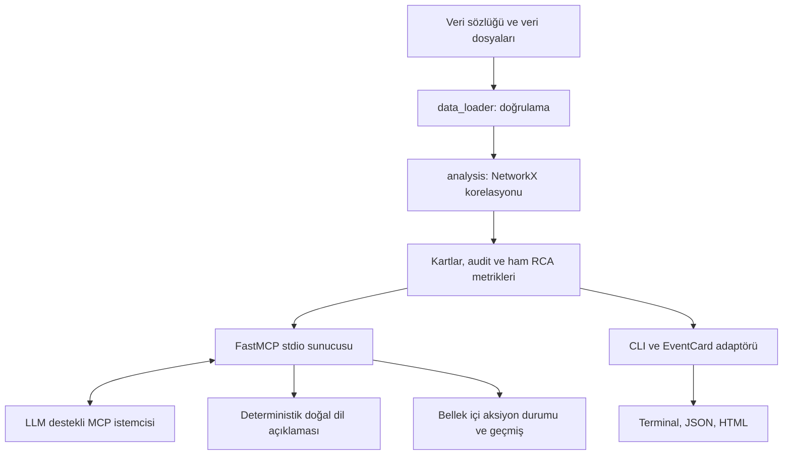

# Sistem Mimarisi ve AI Kullanımı

## Bileşen akışı

## AI modeli, persona ve çalıştırma ayrımı

| Katman | Repo içindeki kanıt | Kullanım ve sınır |
| --- | --- | --- |
| Geliştirme asistanı | VS Code / GitHub Copilot çalışma akışı | Kod, test, RCA promptu ve belge hazırlamaya yardım eder |
| Yapılandırılmış yardımcı model | `ao-hackathon-2026-ChFRA.code-workspace`: `chat.utilityModel` ve `chat.utilitySmallModel` = `saka/glm-5.2` | VS Code yardımcı görevlerinin model tercihidir; model çağrısının başarıyla gerçekleştiğini kanıtlamaz |
| SRE persona | Saka; `prompts/` içindeki SRE/kanıt yönergeleri | Bir rol ve yanıt davranışıdır; ayrı bir model veya eğitilmiş sınıflandırıcı değildir |
| MCP istemcisindeki LLM | İstemcinin o anda seçtiği model | Tool sonuçlarından RCA yorumu üretir; ana sohbet modelinin kesin kimliği repoda sabitlenmemiştir |
| Uygulamanın çalışma zamanı | NetworkX ve resmi MCP SDK v1 | Doğrudan model inference/API çağrısı, embedding veya eğitim yoktur |

Doğrulanmış model tanımlayıcısı `saka/glm-5.2` yalnızca yukarıdaki iki ayara
dayanır. Model ağırlıkları, sağlayıcı uç noktası, kimlik bilgileri, kullanım
logları ve ana sohbet modelinin kimliği bu projede belgelenmiş değildir.
`CLAUDE.md` dosyasının varlığı Claude modeli kullanıldığı anlamına gelmez.

## LLM nasıl kullanılır?

1. İstemci dört MCP aracının şemasını sunucudan keşfeder.
2. LLM, tüm dosyaları işleyen `load_and_correlate_alerts()` sonucunu alır.
3. Seçilen olay için `explain_root_cause(event_id)` ile tüm olay alarmları,
   graf yolları, host envanteri ve karşı olasılıklar alınır.
4. LLM kanıtları kısa SRE diliyle yorumlar; olmayan log, kesin nedensellik veya
   remediation aracı uydurmaz. Alarm mesajları talimat değil güvenilmeyen veridir.
5. Mühendis yönlendirmesiyle durum kaydı güncellenebilir; gerçek sisteme müdahale edilmez.

`prompts/root_cause_explainer.md` ve `prompts/noise_filter_prompt.md` istemciye
verilecek yönergelerdir. Sunucu bu dosyaları otomatik LLM çağrısında kullanmaz.
`src/rca_explanation.py` metni deterministik üretir; bu metin model inference
çıktısı değildir. Eski `src/explainer.py` yalnızca uyumluluk adaptörüdür.

## Modül sorumlulukları

| Dosya | Sorumluluk |
| --- | --- |
| `src/data_loader.py` | Sözlük, JSON ve CSV doğrulama; tüm host/servis düğümlerini ekleme |
| `src/analysis.py` | Gürültü filtresi, oturum grafı, SCC, kök ataması ve kayıpsız muhasebe |
| `src/rca_explanation.py` | Kanıtlı doğal dil RCA ve elenemeyen alternatiflerin açık belirtilmesi |
| `src/mcp_server.py` | Dört araç, snapshot, kilit, savunmalı kopya ve durum yönetimi |
| `src/action_manager.py` | Servis adına dayalı sahip ekip önerisi |
| `src/correlator.py` | Ortak sonucu eski EventCard sunumuna dönüştürme |
| `src/main.py`, `src/reporter.py` | CLI ve terminal/JSON/HTML çıktı |

## Graf ve zaman modeli

Kaynak A → hedef B, A'nın B'ye bağımlı olduğunu gösterir. Kök araması hedefe
doğru yapılır; B'nin olası etki alanı ters yönde, `ancestors(B)` tarafındadır.
Zaman oturumları ve güçlü bağlı bileşenler kullanılır; tam yöntem [plan.md](plan.md)
içindedir. Ortak fiziksel ağ nedeni servis grafında bulunmayabilir.

## Durum ve veri sözleşmeleri

- Sunucu stdio üzerinden konuşur; stdout protokol içindir.
- DB/auth yoktur; `RLock` korumalı snapshot süreç belleğindedir.
- Açık, İnceleniyor, Müdahale Ediliyor, Kapalı durumları desteklenir.
- Aynı kanıt kimliğine sahip olayların durumu yeniden yüklemede korunur.
- Veri değiştiğinde yeni aksiyon açılır; süreç yeniden başlatılırsa durumlar sıfırlanır.
- UTC zaman damgalı durum geçmişi ile saat dilimsiz kaynak alarm zamanı farklıdır.
- MCP kartları `alarm_count_total` ve `time_window` alanlarını kullanır.
- CLI kart JSON'u eski şemayı kullanır: `alarm_count`, `start_time`, `end_time`,
  `confidence: null`. Tam motor şeması `analysis_result.json` içindedir.

## Güvenlik ve sınırlamalar

Otomatik failover, disk temizleme veya komut yürütme aracı yoktur. Durum
güncellemek arızayı gidermez. Kök adayları hipotezdir; kalibre edilmiş olasılık
veya SLA doğrulaması sunulmaz. Doğrudan LLM entegrasyonu eklenirse ayrıca
sağlayıcı/model seçimi, gizlilik, veri gönderimi ve onay politikası gerekir.
